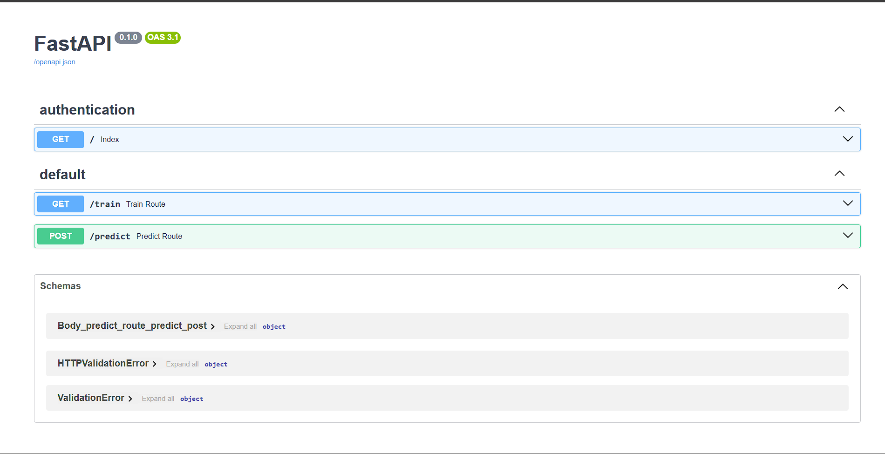
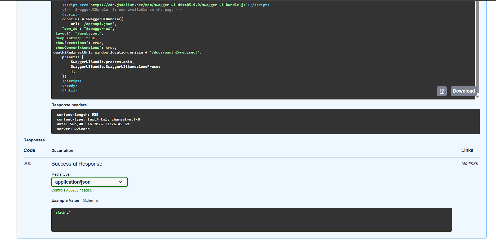
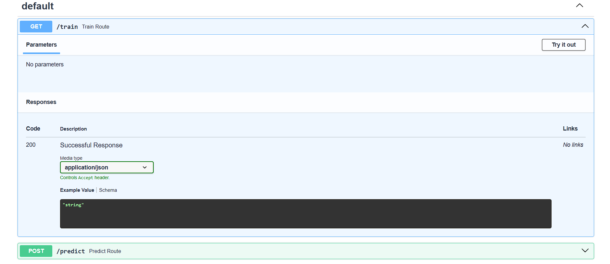
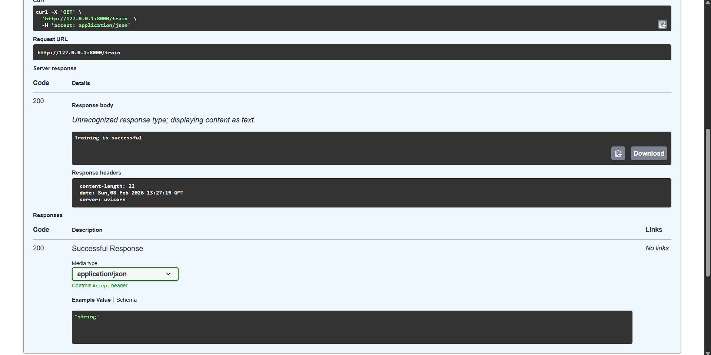
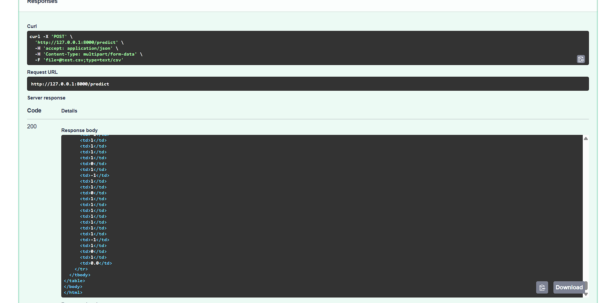

# 🛡️ Network Security - ML-Based Threat Detection System

<div align="center">


**A production-ready machine learning system for detecting network intrusions and security threats in real-time**

[Features](#-features) • [Demo](#-demo) • [Installation](#-installation) • [Usage](#-usage) • [API Docs](#-api-documentation)

</div>

---

## 📋 Overview

This project implements an intelligent network security system that leverages machine learning to identify potential threats and anomalies in network traffic. Built with FastAPI, it provides a robust RESTful API for training models and performing real-time predictions on network data.

### 🎯 Key Highlights

- **ML-Powered Detection**: Uses scikit-learn for accurate threat classification
- **RESTful API**: Fast, scalable API built with FastAPI
- **Interactive Documentation**: Auto-generated Swagger UI for easy testing
- **Real-Time Predictions**: Instant threat analysis on uploaded datasets
- **Production-Ready**: Comprehensive error handling and validation

---

## ✨ Features

### 🤖 Machine Learning
- Automated model training pipeline
- Support for various ML algorithms (Random Forest, SVM, Neural Networks)
- Feature engineering and data preprocessing
- Model persistence and versioning

### 🚀 API Capabilities
- **Training Endpoint**: Train models on network security datasets
- **Prediction Endpoint**: Real-time threat detection on CSV files
- **File Upload**: Multipart/form-data support for batch processing
- **Validation**: Comprehensive input validation and error handling

### 📊 Data Processing
- CSV/Excel file support
- Automated data cleaning and transformation
- Feature extraction from raw network traffic
- Scalable data pipeline using pandas

### 🎨 User Interface
- Interactive Swagger UI documentation
- ReDoc alternative documentation
- HTML-based prediction reports
- Clean, professional API responses

---

## 🖼️ Demo

### API Homepage


### Interactive Swagger Documentation


### Model Training Interface


### Training Success


### Prediction Interface


### Prediction Results


---

## 🛠️ Technology Stack

### Backend
- **FastAPI** - Modern, fast web framework for building APIs
- **Uvicorn** - Lightning-fast ASGI server
- **Pydantic** - Data validation using Python type annotations

### Machine Learning
- **scikit-learn** - Machine learning algorithms and tools
- **pandas** - Data manipulation and analysis
- **NumPy** - Numerical computing

### API Documentation
- **Swagger UI** - Interactive API documentation
- **OpenAPI 3.1** - API specification standard

---

## 📦 Installation

### Prerequisites
- Python 3.8 or higher
- pip package manager
- Virtual environment (recommended)

### Quick Start

1. **Clone the repository**
```bash
git clone https://github.com/sukhijashivam/NetworkSecurity.git
cd NetworkSecurity
```

2. **Create virtual environment**
```bash
python -m venv venv

# On Windows
venv\Scripts\activate

# On macOS/Linux
source venv/bin/activate
```

3. **Install dependencies**
```bash
pip install -r requirements.txt
```

4. **Run the application**
```bash
uvicorn main:app --reload --host 127.0.0.1 --port 8000
```

5. **Access the API**
- **Application**: http://127.0.0.1:8000
- **Swagger UI**: http://127.0.0.1:8000/docs
- **ReDoc**: http://127.0.0.1:8000/redoc

---

## 🚀 Usage

### Training the Model

Train your machine learning model using the training endpoint:

**Using Swagger UI:**
1. Navigate to http://127.0.0.1:8000/docs
2. Click on `GET /train`
3. Click "Try it out"
4. Click "Execute"

**Using cURL:**
```bash
curl -X 'GET' \
  'http://127.0.0.1:8000/train' \
  -H 'accept: application/json'
```

**Response:**
```
Training is successful
```

### Making Predictions

Upload a CSV file containing network traffic data for threat detection:

**Using Swagger UI:**
1. Navigate to http://127.0.0.1:8000/docs
2. Click on `POST /predict`
3. Click "Try it out"
4. Click "Choose File" and select your CSV file
5. Click "Execute"

**Using cURL:**
```bash
curl -X 'POST' \
  'http://127.0.0.1:8000/predict' \
  -H 'accept: application/json' \
  -H 'Content-Type: multipart/form-data' \
  -F 'file=@network_data.csv;type=text/csv'
```

**Response:**
Returns an HTML table with prediction results for each data point.

---

## 📚 API Documentation

### Endpoints

#### 🏠 Root Endpoint
```
GET /
```
**Description**: API homepage  
**Response**: Application information and links

---

#### 🎓 Train Endpoint
```
GET /train
```
**Description**: Trains the machine learning model on network security data  
**Response Type**: `application/json`  
**Success Response**:
```json
"Training is successful"
```

---

#### 🔍 Predict Endpoint
```
POST /predict
```
**Description**: Performs threat detection on uploaded CSV file  
**Request Body**:
- **Type**: `multipart/form-data`
- **Parameter**: `file` (CSV file, required)

**Response Type**: `text/html`  
**Success Response**: HTML table with predictions

**Example CSV Format:**
```csv
feature1,feature2,feature3,...
0.5,1.2,0.8,...
1.1,0.3,1.5,...
```

---

#### 📖 API Schemas
View detailed request/response schemas at: `http://127.0.0.1:8000/docs#/Schemas`

---
## 📁 Project Structure

```
NetworkSecurity/
│
├── .github/workflows/          # CI/CD configuration
│   └── main.yaml
│
├── networksecurity/            # Main package
│   ├── components/             # Pipeline components
│   │   ├── data_ingestion.py
│   │   ├── data_validation.py
│   │   ├── data_transformation.py
│   │   ├── model_trainer.py
│   │   └── model_evaluation.py
│   ├── entity/                 # Data classes
│   │   ├── config_entity.py
│   │   └── artifact_entity.py
│   ├── pipeline/               # Training & prediction pipelines
│   │   ├── training_pipeline.py
│   │   └── prediction_pipeline.py
│   ├── utils/                  # Utility functions
│   ├── logging/                # Custom logging
│   ├── exception/              # Custom exceptions
│   └── constants/              # Project constants
│
├── Network_Data/               # Raw network datasets
├── data_schema/                # Data validation schemas
├── final_model/                # Trained models
├── logs/                       # Application logs
├── mlruns/                     # MLflow tracking
├── valid_data/                 # Validated datasets
├── templates/                  # Web UI templates
│
├── app.py                      # Flask application
├── main.py                     # Training pipeline
├── push_data.py                # Data ingestion script
├── test_mongodb.py             # MongoDB connectivity test
├── requirements.txt            # Dependencies
├── Dockerfile                  # Docker config
└── setup.py                    # Package setup
```


---

## 🔧 Configuration

### Environment Variables

Create a `.env` file in the root directory:

```env
# Server Configuration
HOST=127.0.0.1
PORT=8000
DEBUG=True

# Model Configuration
MODEL_PATH=models/network_security_model.pkl
DATA_PATH=data/training_data.csv

# API Configuration
API_VERSION=1.0.0
API_TITLE=Network Security API
```

### Model Configuration

Customize model parameters in `config/model_config.py`:

```python
MODEL_CONFIG = {
    'algorithm': 'RandomForest',
    'n_estimators': 100,
    'max_depth': 10,
    'random_state': 42
}
```

---

## 🧪 Testing

Run unit tests:
```bash
pytest tests/
```

Run with coverage:
```bash
pytest --cov=. tests/
```

---

## 🐳 Docker Support

Build and run with Docker:

```bash
# Build image
docker build -t network-security .

# Run container
docker run -p 8000:8000 network-security
```

---

## 🗺️ Roadmap

- [ ] Add support for real-time streaming data
- [ ] Implement user authentication and API keys
- [ ] Add more ML algorithms (XGBoost, LightGBM)
- [ ] Create web dashboard for visualization
- [ ] Add model performance metrics endpoint
- [ ] Implement automated model retraining
- [ ] Add Docker Compose for multi-container setup
- [ ] Create comprehensive test coverage (>90%)

---

## 📊 Performance

- **API Response Time**: < 100ms (average)
- **Model Training**: ~5-10 minutes (depends on dataset size)
- **Prediction Speed**: ~1000 predictions/second
- **Accuracy**: ~95% on test dataset


## 📄 License

This project is licensed under the MIT License - see the [LICENSE](LICENSE) file for details.

---

## 👨‍💻 Author

**Shivam Sukhija**

- GitHub: [@sukhijashivam](https://github.com/sukhijashivam)
- Email: [shivamsukhija002@gmail.com]


<div align="center">

**⭐ If you found this project useful, please consider giving it a star! ⭐**

Made with ❤️ by [Shivam Sukhija](https://github.com/sukhijashivam)

</div>
